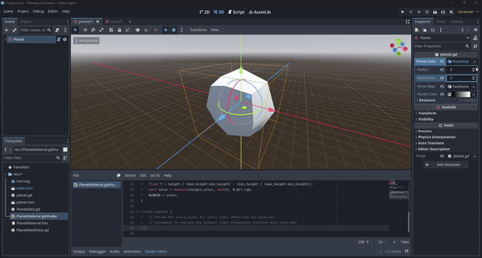

# Godot Procedural Generation Tool Kit (GDPTK) 

This project contains design and implementation methods for generating 3D procedural terrain & landscapes in the Godot Engine using a combination of custom shaders and noise maps. This effect is achieved by taking planes and mutating their positional arguments to fit some noise that is generated or provided by the user. Surfaces are created and colored based on height variations, with options for detailed customization, including resolution and color gradients.

## Features

- **Procedural Surface and Planet Generation**: Customizable planar & sphere resolution, radius, and noise-based terrain deformation.
- **Dynamic Shader Coloring**: A shader dynamically colors the planet's surface based on height, with support for gradient textures.
- **Real-Time Updates**: Any changes in parameters immediately update the planet’s appearance within the editor.

## Project Structure

This project offers three methods for generating procedural terrain:
1. **Infinite Planar (Wandering) Procedural Terrain**
   - *Non-Shader*
   - *Shader*
2. **Planetary Procedural Terrain**

### Files

#### Non-Shader Planar Files
- **`TerrainGen.gd`**: Planar terrain generation with parameters `resolution`, `noise_map` (CPU based). 

#### Shader Planar Files
- **`VertexTerrain.gd`**: Planar terrain generation with parameters `height_scale` (GPU based). Resolution is determined by a clipmap that is a appropriately subdivided plane with differing levels of vertex counts.


#### Planetary Files
- **`PlanetData.gd`**: Resource class defining planet properties like `radius`, `resolution`, `noise_map`, and `planet_color`. Manages minimum and maximum height calculations based on noise values.
- **`PlanetMeshFace.gd`**: Responsible for creating and regenerating a single face of the planet mesh based on `PlanetData` properties. Also handles updating normals and indices.
- **`Planet.gd`**: Main planet node that manages `PlanetMeshFace` nodes. Changes to `PlanetData` properties trigger mesh regeneration and color updates.
- **`planet_shader.shader`**: Custom shader script for coloring the planet based on height values. The shader interpolates colors based on a provided height gradient texture.


## Getting Started

1. Clone or download zip of repository:

2. **Open the Project** in [Godot Engine](https://godotengine.org/download). This project uses **Godot 4.3**.

3. **Adjust Parameters**:
   - **Planet Data**: `PlanetData` resource allows you to customize:
     - `radius`: Controls the overall size of the planet.
     - `resolution`: Controls the number of vertices in the mesh. Higher values yield more detail.
     - `noise_map`: Uses FastNoiseLite for terrain variation.
     - `planet_color`: A `GradientTexture1D` used for height-based coloring.

4. **Run the Scene**:
   - Add the `Planet.gd` script to a root `Node3D` in the scene, assign `PlanetData` settings, and run the scene to view the procedural planet.

## Customization

- **Changing the Radius**: Adjust the `radius` property in `PlanetData` to increase or decrease the planet’s size.
- **Resolution**: Higher values yield a more detailed surface but may affect performance.
- **Noise and Colors**: Modify the `noise_map` and `planet_color` gradient to achieve different terrain types and visuals.




## Roadmap:
- **Adding Clipmap snapping for shader-based planar generation**
- **Adding Quadtree LOD to non-shader & Planetary based generation**
- **Noise and Colors Debugging**
  
## Sources:
This is a collection of combining and simplifying other people's project to create a flexible starting project. <br>
Some inspiration was taken from the following sources: <br>
https://www.redblobgames.com/maps/terrain-from-noise/#elevation-redistribution
https://docs.godotengine.org/en/3.0/tutorials/3d/vertex_displacement_with_shaders.html
https://godotshaders.com/shader/wandering-clipmap-stylized-terrain/
http://pcg.wikidot.com/pcg-algorithm:whittaker-diagram
https://github.com/athillion/ProceduralPlanetGodot
https://github.com/Ombarus/pcg_planet_yt
https://www.youtube.com/@SebastianLague


## Code Overview

### Shader: `planet_shader.shader`
Handles planet coloring based on vertex height.
```glsl
shader_type spatial;

uniform float min_height;
uniform float max_height;
uniform sampler2D height_color;

varying float height;

void vertex() {
    height = length(VERTEX);
}

void fragment() {
    float t = height / (max_height - min_height) - (min_height / (max_height - min_height));
    vec3 color = texture(height_color, vec2(t, 0.0)).rgb;
    ALBEDO = color;
}


